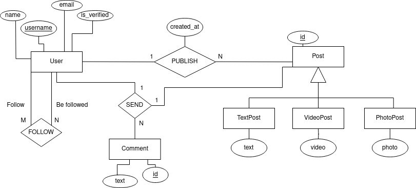

# Panela

"Panela" é uma API que possui o intuito de simular uma rede social, como Instagram ou Facebook, de forma simples.

## Tecnologias utilizadas

- Python com FastAPI para criação de uma API para interagir com o banco de dados Neo4J.
- Neo4J como banco de dados baseado em grafos para armazenar as informações a respeito de followers e blocks.
- PostgreSQL como banco de dados relacional para armazenar quaisquer outros tipos de informações a respeito do usuário,
  feed, comentários dos posts e muito mais.
- Docker e Docker Compose para criar containers para Neo4J e MySQL.
- Bash para automatização de comandos do Docker e outros

## Modelo conceitual

## Contribuidores

- [Hícaro](https://github.com/HicaroD)
- [Wemilly](https://github.com/wemillymaria)
- [Rebeca](https://github.com/becacoli)

## Licença
Este projeto é licenciado sob a licença MIT. Ver [LICENSE](LICENSE).
